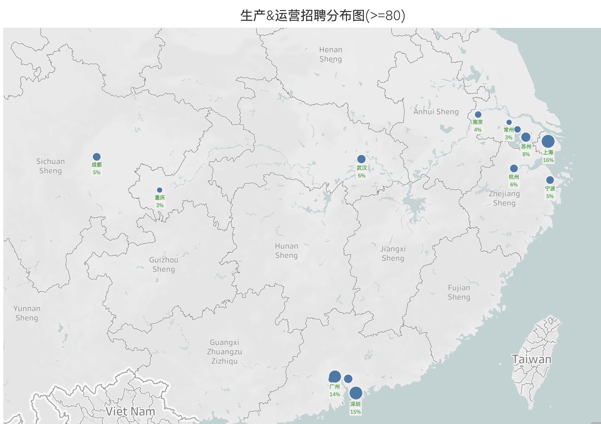
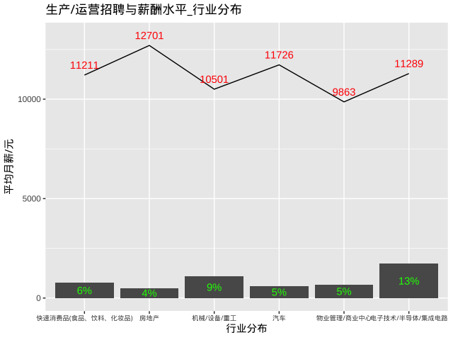
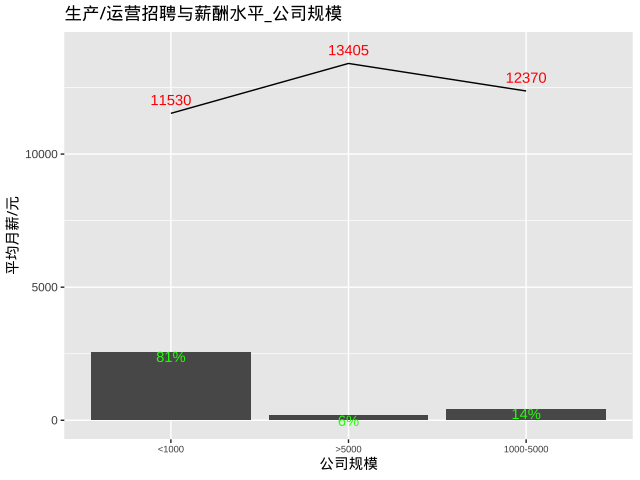
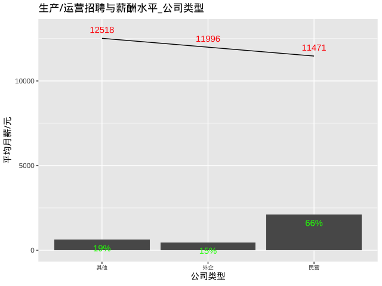
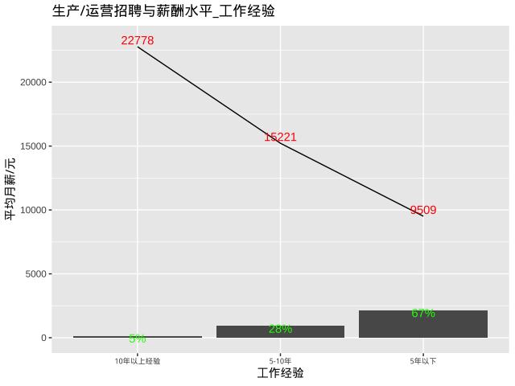
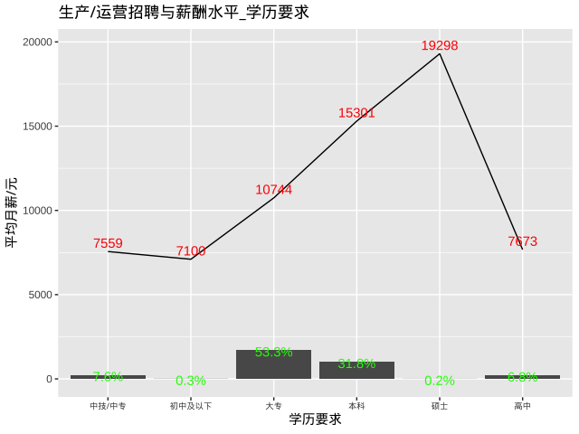
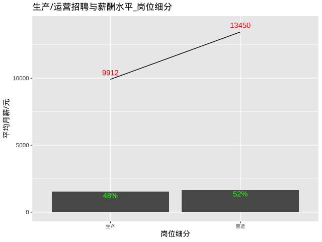

# 生产&运营招聘和薪酬水平

## 总述

本次采集有效数据3200条，主要分析生产&运营岗位招聘和薪酬水平，我们将从如下方面分析：

-   01.城市分布：上海占16%，平均月薪14062元；深圳占15%，平均月薪12872元；广州占14%，平均月薪11522元，其余城市均在8%或以下。

-   02.行业分布：电子技术/半导体/集成电路占13%，平均月薪11289元；机械/设备/重工占9%，平均月薪10501元；快消品占6%，平均月薪11211元；其余行业均在5%或以下。

-   03.公司规模：1000人以下占81%，平均月薪11530元；1000-5000人占14%，平均月薪12370元；5000人以上占6%，平均月薪13405元。

-   04.公司类型：民营占66%，平均月薪11471元；外企占15%，平均月薪11996元。

-   05.工作经验：5年以下占67%，平均月薪9509元；5-10年占28%，平均月薪15221元。

-   06.学历要求：大专占53%，平均月薪10744；本科占32%，平均月薪15301元。

-   07.细分岗位：生产平均月薪9912元；营运平均月薪13450元。

## 01.城市分布

## 02.行业分布

## 03.公司规模

## 04.公司类型

## 05.工作经验

## 06.学历要求

## 07.细分岗位

